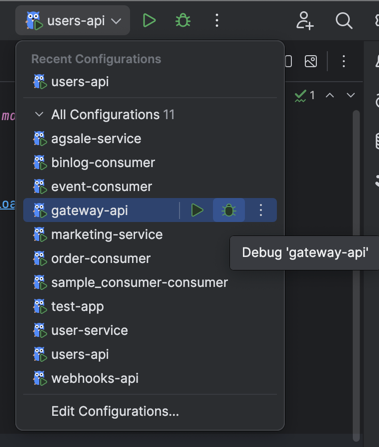

## Getting Started
### 1. Set up consul (service discovery and configuration management)
```shell
docker run -d --name=consul -p 8500:8500 consul
```
or download consul binary from https://www.consul.io/downloads

### 2. Install atcli packages
```shell
go install pkg/toolkit/atcli.go
```
### 3. Generate goland debug configuration
```shell
atcli gen goland-config
```
### 4. Run services
Start debugging services by click the debug button in Goland.

